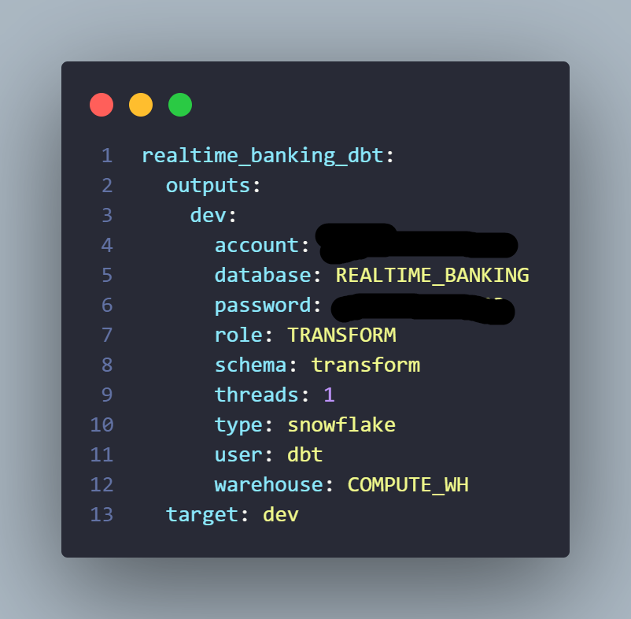

<h1 align="center">Real-time Banking Data Warehouse</h1>

<p align="center">
  <a href="README.md">English</a> ·
  <a href="README.vi.md">Tiếng Việt</a>
</p>

This project implements an end-to-end **Real-time Data Engineering** pipeline for a Banking System. It simulates high-volume transactional data, captures changes in real-time using **CDC (Change Data Capture)**, and builds a scalable Data Warehouse following the **ELT** paradigm.

The pipeline is fully containerized using Docker, utilizing **PostgreSQL** for storage, **Debezium** & **Kafka** for streaming, **Airflow** for orchestration, and **dbt** for transformation on **Snowflake**.

# Architecture Overview

The pipeline is designed to handle the complete lifecycle of data:
1. **Source Layer (OLTP):** A Python script generates synthetic banking data (Customers, Accounts, Transactions) into a **PostgreSQL** database.
2. **Ingestion Layer (CDC Streaming):**
    * **Debezium** captures row-level changes (INSERT, UPDATE, DELETE) from Postgres WAL logs.
    * Data is streamed into **Apache Kafka** topics.
    * A Custom Python Sink Connector consumes Kafka messages, batches them into **Parquet** files, and uploads them to **MinIO** (S3-compatible Data Lake).
3. **Orchestration & Loading (ELT):**
    * **Apache Airflow** orchestrates the data movement.
    * It downloads Parquet files from MinIO (Landing Zone).
    * Loads data into **Snowflake**'s `RAW` schema using `COPY INTO` with `VARIANT` data type support.
    * Moves processed files to an Archive Zone for incremental loading efficiency.
4. **Transformation Layer (dbt):**
    * **Staging:** Deduplicates CDC logs to retrieve the latest state of data.
    * **Snapshots:** Implements **SCD Type 2 (Slowly Changing Dimensions)** for the `accounts` table to track historical balance changes.
    * **Marts:** Models data into a **Fact Constellation Schema** with a **Bridge Table** to handle complex Many-to-Many relationships.

# Project Structure

# Technologies Used
| Technology | Function |
|:---|:---|
| **PostgreSQL** | Source OLTP Database |
| **Debezium** | Change Data Capture (CDC) platform |
| **Apache Kafka** | Distributed Event Streaming Platform |
| **MinIO** | Object Storage (Data Lake) |
| **Apache Airflow** | Workflow Orchestration (Python Operator, Bash Operator) |
| **Snowflake** | Cloud Data Warehouse |
| **dbt** | Data Transformation & Testing (SCD Type 2, Generic Tests) |
| **Docker Compose** | Infrastructure as Code (IaC) |

# Key Features Implemented

- **Change Data Capture (CDC)**: Real-time tracking of database changes without polling, ensuring zero data loss and low latency.
- **Incremental Loading**: Airflow DAGs are designed to process only new files from the Landing Zone, optimizing performance and cost.
- **SCD Type 2 Handling**: Implemented `dbt snapshots` to track historical account balances, enabling point-in-time financial analysis.
- **Complex Data Modeling**:
    - **Bridge Table Pattern**: Handled the **Many-to-Many** relationship between Customers and Accounts (Joint Accounts), preventing double-counting in financial reports.
    - **Variant Handling**: Leveraged Snowflake's semi-structured data capabilities to handle schema evolution.
- **Automated Testing**:
    - **Generic Tests**: `unique`, `not_null`, `accepted_values`, `relationships`.
    - **Custom Logic**: Implemented macros to validate business rules (e.g., Account balance must not be negative).

# Data Modeling
- Here is the relational schema of the data stored in PostgreSQL before being ingested into the Data Warehouse.


- Here is how the data is modeled in `Snowflake`.


- The final **Fact Constellation Schema** in the Data Warehouse.


* **Fact Table**: `fct_transactions` (Transactional grain).
* **Dimension Tables**: `dim_customers`, `dim_accounts` (SCD Type 2).
* **Bridge Table**: `map_account_owner` (Resolves N-N relationships).
* **Aggregate Table**: `agg_daily_account_activity` (Daily rolled-up metrics).

# Installation and Setup Guide

### Prerequisites
- Docker desktop.
- Python 3.10
- Snowflake Account
- Install `uv` package manager
- Install `Dbeaver` to connect to `PostgreSQL`

### Environment setup
1. Clone the repository
2. Synchronize virtual environment
```bash
uv sync
```
### Infrastructure setup
Build the custom Airflow image
```bash
docker build -f ./airflow/Dockerfile.airflow -t <custom-airflow:banking-realtime-warehouse> .
```
### Create role, user and tables in Snowflake
1. Create a new role and user for this project in Snowflake
```sql
-- Use an admin role
USE ROLE ACCOUNTADMIN;

-- Create the `transform` role and assign it to ACCOUNTADMIN
CREATE ROLE IF NOT EXISTS TRANSFORM;
GRANT ROLE TRANSFORM TO ROLE ACCOUNTADMIN;
-- Create a default warehouse
CREATE WAREHOUSE IF NOT EXISTS COMPUTE_WH;
GRANT OPERATE ON WAREHOUSE COMPUTE_WH TO ROLE TRANSFORM;

-- Create the `dbt` user and assign to the transform role
CREATE USER IF NOT EXISTS dbt
    PASSWORD=''
    LOGIN_NAME='dbt'
    MUST_CHANGE_PASSWORD=FALSE
    DEFAULT_WAREHOUSE='COMPUTE_WH'
    DEFAULT_ROLE=TRANSFORM
    COMMENT='DBT user used for data transformation';
ALTER USER dbt SET TYPE = LEGACY_SERVICE;
GRANT ROLE TRANSFORM TO USER dbt;
```
2. Create the database and schema for raw data, then grant privileges to the `TRANSFORM` role
```sql
CREATE DATABASE IF NOT EXISTS REALTIME_BANKING;
CREATE SCHEMA IF NOT EXISTS REALTIME_BANKING.RAW;

GRANT ALL ON DATABASE REALTIME_BANKING TO ROLE TRANSFORM;

GRANT ALL ON ALL SCHEMAS IN DATABASE REALTIME_BANKING TO ROLE TRANSFORM;
GRANT ALL ON FUTURE SCHEMAS IN DATABASE REALTIME_BANKING TO ROLE TRANSFORM;
GRANT ALL ON ALL TABLES IN SCHEMA REALTIME_BANKING.RAW TO ROLE TRANSFORM;
GRANT ALL ON FUTURE TABLES IN SCHEMA REALTIME_BANKING.RAW TO ROLE TRANSFORM;
```

### Configure `dbt` profiles
1. Initialize `dbt` project
```bash
dbt init realtime_banking_dbt
```
2. Fill in the `profiles.yml` file with your Snowflake credentials as below


# How to run the project

# ✉️ Contact
Feel free to connect with me on the following platforms:
- Email: khanhnhan012@gmail.com
- [](https://www.facebook.com/nguyen.khanh.nhan.905779)
- [](https://www.linkedin.com/in/nhan-nguyen-b22023260/)